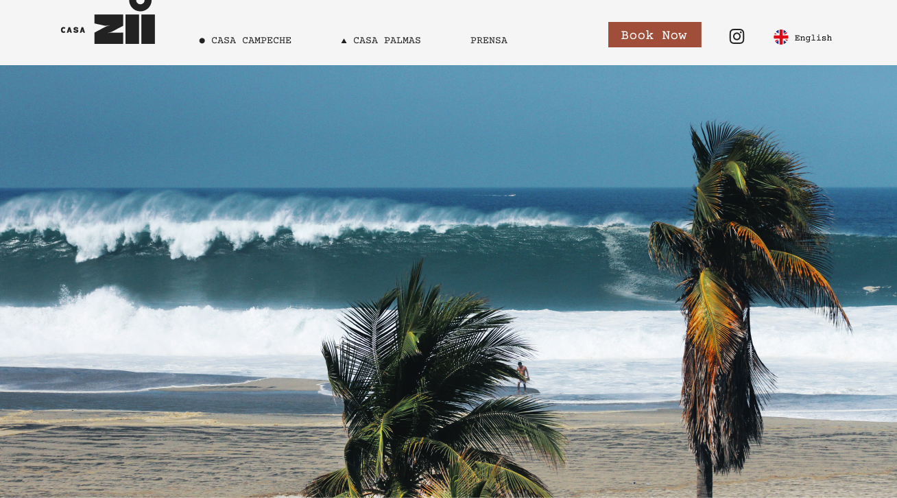
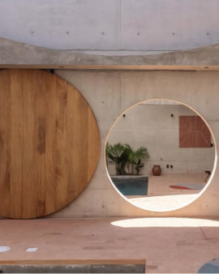
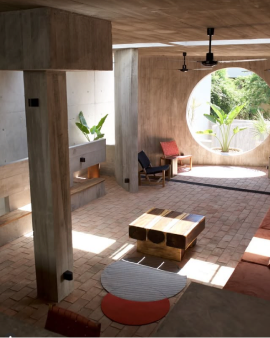
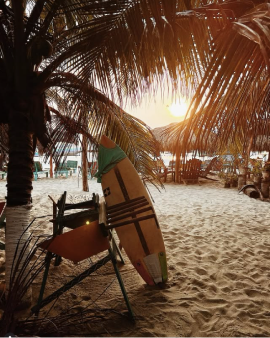
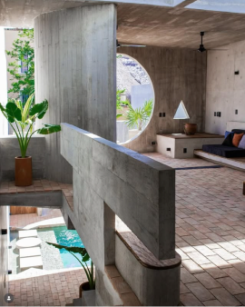
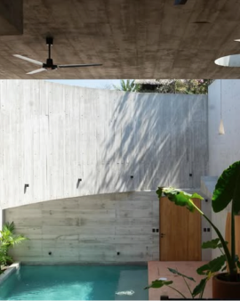
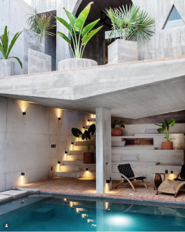
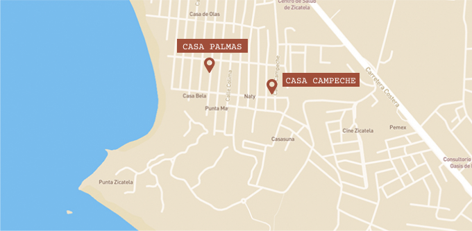
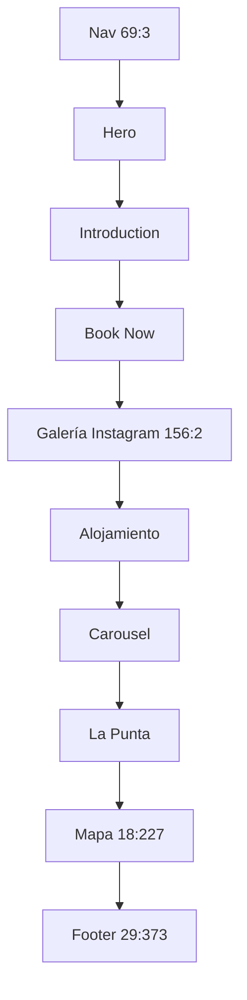

# Casa Zii Navigation, Instagram Gallery, and Map Design Spec

**Date:** 2026-08-23  
**Status:** Locked — Figma + these annotations only
**Scope:** Homepage and shared site chrome

## Rule

Implement from **only two sources**:

1. The Figma file [CASA ZII](https://www.figma.com/design/JYwQ77v9OOLOlxmlKaTNu7/CASA-ZII), page `Landing Page` (`0:1`).
2. The annotations in this spec.

Do not use other sites, other mockups, or invent layout that is not in those two sources.

## Source of truth

- File key: `JYwQ77v9OOLOlxmlKaTNu7`
- Nodes:
  - `69:3` — `Nav` (header chrome only; the same frame also contains the hero image)
  - `156:2` — `Galería Instagram`
  - `18:227` — `Mapa`
  - `29:373` — `Footer` (address strings on canvas; footer restyle is out of scope)
  - `131:3` — mobile adults-only strip (removed by annotation below)

## Visual board

### Figma navigation reference (`69:3`)



Desktop header, from the node:

- White bar above the full-bleed hero.
- Left: Casa Zii logo.
- Center, one line: `● CASA CAMPECHE` · `▲ CASA PALMAS` · `PRENSA`.
- Right: terracotta `Book Now` · Instagram icon · UK flag + `English`.
- Frame size including hero: `1308 × 726`. Header chrome is the white band at the top of that frame.

### Exact gallery exports (`156:2`)

Implementation order is Figma order: Rectangle 1 → 6.

<table>
  <tr>
    <td></td>
    <td></td>
    <td></td>
  </tr>
  <tr>
    <td></td>
    <td></td>
    <td></td>
  </tr>
</table>

Measured on the node:

- Frame: `836 × 687.5`
- Tiles: `270 × 337.5` (keep local exports; do not recrop)
- Desktop: 3 columns × 2 rows
- Gutters: `13` horizontal, `12.5` vertical

### Figma map reference (`18:227`)



Measured on the node:

- Size: `680 × 333`
- Illustrated map (beige land, blue water, white streets)
- Two terracotta pins + labels: `CASA PALMAS` and `CASA CAMPECHE`
- No address cards and no extra chrome in Figma — cards/CTAs exist only if listed in the annotations below

### Page flow (from the Figma page order)



## Annotations

These are the only rules that are not pixels in Figma.

### 1. Shared navigation

- Remove the black `AnnouncementBar` from every rendered page, including the mobile strip `131:3` (“A UNIQUE STAY / ADULTS ONLY”). That copy is not part of the new header.
- Keep one fixed white `NavigationBar` at the top of the viewport, visible while scrolling on desktop and mobile.
- Three-zone layout so the center items stay visually centered:
  - left: Casa Zii logo;
  - center: Casa Campeche, Casa Palmas, Prensa/Press;
  - right: Reservar/Book Now, Instagram, language toggle.
- Desktop look from `69:3`: white surface, dark text, Courier Prime, terracotta Book Now.
- Mobile annotation: keep logo and primary action visible, put the menu trigger in a stable position, use the existing full-screen menu, do not let the header drift horizontally.
- Offset page content so the fixed header never covers the first section.
- Split the single Figma text node into three real links. Do not hide the bar on scroll.

### 2. Instagram gallery

- Replace the homepage 13-image collage with `156:2` only. Leave the architectural carousel as it is.
- Use `public/instagram-gallery/figma-01.png` … `figma-06.png`. Do not use `public/Rectangle*.png`. Do not recrop in CSS.
- Desktop grid as measured above. On narrow screens, reduce columns (2 then 1) without changing the tile aspect ratio `270 / 337.5`.
- Data shape:

  ```ts
  type InstagramGalleryItem = {
    src: string;
    alt: string;
    href: string;
  };
  ```

- Each tile is an external link to its own Instagram post (`target` new tab, `rel="noreferrer"`). Do not point every tile at the generic profile. The six post URLs are still required from the owner before final acceptance.
- Visible keyboard focus. Hover must not change the crop.

### 3. Location

- Paint `18:227` as the map: same size, same illustrated look, same two pins and labels (`CASA PALMAS`, `CASA CAMPECHE`).
- Annotation on top of that node: the section must make both Casa Zii addresses understandable and must open each one in Google Maps.
- Addresses from this spec (not invented, not taken from other sites):
  - Casa Palmas: Calle de la Paloma S/N, in front of Casa Paloma, La Punta, Brisas de Zicatela, 70938 Puerto Escondido, Oaxaca, Mexico.
  - Casa Campeche: Calle Campeche S/N, in front of Pancho Villas Punta Zicatela, La Punta, Brisas de Zicatela, 70938 Puerto Escondido, Oaxaca, Mexico.
- Each address has an “Abrir mapa” action using its supplied Google Maps URL.
- The map is interactive (lazy-loaded embed, useful title, no horizontal scroll on mobile). No Google Maps API key for this first embed.
- Visual language stays the Figma map: warm beige/blue field, Courier Prime labels, terracotta pins. Do not add a generic card grid.

## Implementation boundaries

Files:

- `app/components/NavigationBar.tsx`
- `app/components/AnnouncementBar.tsx` and the pages that render it
- Homepage gallery: replace the collage on `app/homepage/page.tsx` (new focused component if needed)
- `app/components/MapSection.tsx`
- `public/instagram-gallery/figma-01.png` … `figma-06.png` (already exported)

Out of scope except header spacing: Guesty, property page content, footer restyle, architectural carousel.

## Accessibility and behavior

- Every nav item and gallery tile is keyboard reachable.
- Gallery alts go through the existing ES/EN language context.
- Mobile menu closes after navigation and does not leave scroll locked.
- Instagram and Google Maps links expose their destination in the accessible name.
- Fixed nav never covers a focus target.

## Acceptance criteria

1. The black adults-only strip is gone on homepage, booking, property, press, and contact.
2. The white nav stays visible while scrolling. On desktop, the center items are visually centered as in `69:3`. On mobile, logo + primary action + menu trigger stay usable and do not drift.
3. Homepage gallery uses the six Figma exports, same crop and order as `156:2`.
4. Each gallery tile opens its own supplied Instagram post URL. Generic profile fallbacks are not accepted for release.
5. The location section looks like `18:227` (two pins, two labels), shows both annotated addresses, and opens both supplied Google Maps URLs.
6. No horizontal overflow, no clipped nav, no content hidden behind the fixed header.
7. Production build succeeds; no new console errors in browser checks.

## Resolved inputs

1. Six Instagram post URLs in Figma order are mapped in `app/components/InstagramGallery.tsx`.
2. The two Google Maps URLs are mapped in `app/components/MapSection.tsx`.

The implementation can now be validated against Figma + the annotations above.
